# 应用回归分析

## 一、回归分析概述

## 二、一元线性回归

> 理论回归模型：$y=\beta_0+\beta_1x+\varepsilon$

> 回归方程:$E(y)=\beta_0+\beta_1x$

> 样本回归模型：$y_i=\beta_0+\beta_1x_i+\varepsilon_i$

> 经验回归方程:$\hat{y}=\hat{\beta_0}+\hat{\beta_1}x$

### 关于方差与协方差的补充

- **方差 **在概率论和统计方差衡量[随机变量](https://baike.baidu.com/item/随机变量/828980?fromModule=lemma_inlink)或一组数据时离散程度的度量，用$Var$表示

1. $c$是常数，则$Var(c)=0$
2. $c$是常数，$X$是随机变量，则$Var(cX)=c^2Var(X)~~~~~Var(c+X)=Var(X)$
3. $X,Y$是随机变量，则$Var(X+Y)=Var(X)+Var(Y)+2Cov(X,Y)~~~~~Var(X-Y)=Var(X)+Var(Y)-2Cov(X,Y)$
4. 特别地，当$X,Y$是两个不相关的随机变量时，$Var(X+Y)=Var(X)+Var(Y)$
5. $a,b$是常数，$X,Y$是随机变量，则$Var(aX+bY)=a^2Var(X)+b^2Var(Y)+2abCov(X,Y)$

- **协方差** 在[概率论](https://baike.baidu.com/item/概率论/829122?fromModule=lemma_inlink)和[统计学](https://baike.baidu.com/item/统计学/1175?fromModule=lemma_inlink)中用于衡量两个变量的总体[误差](https://baike.baidu.com/item/误差/738024?fromModule=lemma_inlink)，用$Cov$​表示

1. $ Cov(X,Y)=Cov(Y,X)$
2. $Cov(aX,bY)=abCov(X,Y)$
3. $Cov(X_1+X_2,Y)=Cov(X_1,Y)+Cov(X_2,Y)$
4. $Cov(X+a,Y+b)=Cov(X,Y)$
5. 由协方差定义，可以看出$Cov(X,X)=Var(X)，Cov(Y,Y)=Var(Y)$

### 关于$y,E(y),\hat{y}$的补充

1. 我们一般不加以区分$y$与$y_i$
2. $y_i$称为**观测值**
3. $y_i$的**回归值**是$E(y_i)$
4. $y_i$的**回归拟合值**是$\hat{y_i}$

### 参数$\beta_0,\beta_1$​的估计

令$\bar{x}=\frac{1}{n}\sum_{i=1}^n x_i,\bar{y}=\frac{1}{n}\sum_{i=1}^n y_i$
$$
2.18~①式：\\
\begin{align}
\sum_{i=1}^n\left(y_i-\hat{\beta_0}-\hat{\beta}_1 x_i\right) &= 0 \\
\sum_{i=1}^n y_i-\sum_{i=1}^n\left(\hat{\beta}_0+\hat{\beta}_1 x_i\right) &= 0 \\
\sum_{i=1}^n\left(\hat{\beta_0}+\hat{\beta_1} x_i\right) &= \sum_{i=1}^n y_i \\
\sum_{i=1}^n \hat{\beta_0}+\sum_{i=1}^n \hat{\beta_1} x_i &= \sum_{i=1}^n y_i \\
n \hat{\beta}_0+\hat{\beta}_1 \sum_{i=1}^n x_i &= \sum_{i=1}^n y_i \\
\hat{\beta_1} \sum_{i=1}^n x_i &= \sum_{i=1}^n y_i-n \hat{\beta_0} \\
\hat{\beta}_1 &= \frac{\sum_{i=1}^n y_i-n \hat{\beta_0}}{\sum_{i=1}^n x_i} \\
\hat{\beta_1} &= \frac{n \bar{y}-n \hat{\beta}_0}{n \bar{x}} \\
\hat{\beta_1} &= \frac{\bar{y}-\beta_0}{\bar{x}} \\
\bar{x} \hat{\beta}_1 &= \bar{y}-\hat{\beta}_0 \\
\beta_0 &= \bar{y}-\bar{x} \hat{\beta}_1
\end{align}
$$

$$
2.18~②式：\\
\begin{aligned}
& \sum_{i=1}^n\left(y_i-\hat{\beta}_0-\hat{\beta_1} x_i\right) x_i=0 \\
& \sum_{i=1}^n\left[x_i y_i-x_i\left(\bar{y}-\bar{x} \hat{\beta}_1\right)-\hat{\beta}_1 x_i{ }^2\right]=0 \\
& \sum_{i=1}^n\left[x_i y_i-x_i \bar{y}+\bar{x} x_i \hat{\beta}_1-\hat{\beta}_1 x_i{ }^2\right]=0 \\
& \sum_{i=1}^n\left(x_i y_i-x_i \bar{y}\right)+\sum_{i=1}^n\left(x_i \bar{x} \hat{\beta}_1-\hat{\beta}_1 x_i{ }^2\right)=0 \\
& \hat{\beta}_1 \sum_{i=1}^n\left(x_i \bar{x}-x_i^2\right)=-\sum_{i=1}^n\left(x_i y_i-x_i \bar{y}\right) \\
 \hat{\beta}_1&=\frac{-\sum_{i=1}^n\left(x_i y_i-x_i \bar{y}\right)}{\sum_{i=1}^n\left(x_i \bar{x}-x_i^2\right)} \\
& =\frac{-\sum_{i=1}^n x_i y_i+\sum_{i=1}^n x_i \bar{y}}{\sum_{i=1}^n x_i \bar{x}-\sum_{i=1}^n x_i^2} \\
& =\frac{\bar{y} \sum_{i=1}^n x_i-\sum_{i=1}^n x_i y_i}{\bar{x} \sum_{i=1}^n x_i-\sum_{i=1}^n x_i^2} \\
& =\frac{n \bar{x} \bar{y}-\sum_{i=1}^n x_i y_i}{n \bar{x}^2-\sum_{i=1}^n x_i^2} \\
& =\frac{\sum_{i=1}^n x_iy_i-n \bar{x}{\bar{y}}}{\sum_{i=1}^n x_i^2-n \bar{x}^2} \\
& =\frac{\sum_{i=1}^n x_i y_i-n \bar{x} \bar{y}+n x \bar{y}-n \bar{x} \bar{y}}{\sum_{i=1}^n x_i^2-n \bar{x}^2+n \bar{x}^2-n \bar{x}^2} \\
& =\frac{\sum_{i=1}^n x_i y_i-\bar{y} \sum_{i=1}^n x_i-\bar{x} \sum_{i=1}^n y_i+n \bar{x} \bar{y}}{\sum_{i=1}^n x_i^2-2 n \bar{x}^2+n \bar{x}^2} \\
& =\frac{\sum_{i=1}^n x_i{y_i}-\bar{y} \sum_{i=1}^n x_i-\bar{x} \sum_{i=1}^n y_i+n \bar{x} \bar{y}}{\sum_{i=1}^n x_i^2-2 n \bar{x} \cdot \frac{1}{n} \sum_{i=1}^n x_i+\sum_{i=1}^n \bar{x}^2} \\
& =\frac{\sum_{i=1}^n x_i y_i-\sum_{i=1}^n x_i \bar{y}-\sum_{i=1}^n \bar{x} y_i+\sum_{i=1}^n \bar{x} \bar{y}}{\sum_{i=1}^n\left(x_i^2-2 \bar{x} x_i+\bar{x}^2\right)} \\
& =\frac{\sum_{i=1}^n(x_iy_i-x_i\bar{y}-\bar{x}y_i+\bar{x}\bar{y})}{\sum_{i=1}^n(x_i-\bar{x})^2}\\
& =\frac{\sum_{i=1}^n(x_i-\bar{x})(y_i-\bar{y})}{\sum_{i=1}^n(x_i-\bar{x})^2}
\end{aligned}
$$

记$L_{xx}=\sum_{i=1}^n(x_i-\bar{x})^2,L_{xy}=\sum_{i=1}^n(x_i-\bar{x})(y_i-\bar{y})$，则
$$
\hat{\beta_1}=\frac{L_{xy}}{L_{xx}}
$$
**几个变形式子**

- $$
  \begin{aligned}
   L_{x x}&=\sum_{i=1}^n\left(x_i-\bar{x}\right)^2 \\
  &=\sum_{i=1}^n\left(x_i^2+\bar{x}^2-2 x_i \bar{x}\right) \\
  &=\sum_{i=1}^n x_i^2+\sum_{i=1}^n \bar{x}^2-2 \bar{x} \sum_{i=1}^n x_i \\
  &=\sum_{i=1}^n x_i^2+n \bar{x}^2-2 n \bar{x}^2 \\
  & =\sum_{i=1}^n x_i^2-n \bar{x}^2
  \end{aligned}
  $$

- $$
  \begin{aligned}
   L_{ x y}&=\sum_{i=1}^n(x_i-\bar{x})(y_i-\bar{y}) \\
  &=  \sum_{i=1}^n\left(x_i y_i-\bar{x} y_i-x_i \bar{y}+\bar{x} \bar{y}\right) \\
  &=  \sum_{i=1}^n x_i y_i-\bar{x} \sum_{i=1}^n y_i-\bar{y} \sum_{i=1}^n x_i+\sum_{i=1}^n \bar{x} \bar{y} \\
  & =\sum_{i=1}^n x_i y_i-n \bar{x} \bar{y}-n \bar{x} \bar{y}+n \bar{x} \bar{y} \\
  &  =\sum_{i=1}^n x_i y_i-n \bar{x}\bar{y}
  \end{aligned}
  $$

- $$
  \begin{aligned}
  L_{xy} &=\sum_{i=1}^n\left(x_i-\bar{x}\right)\left(y_i-\bar{y}\right) \\
  &=\sum_{i=1}^n\left[\left(x_i-\bar{x}\right) y_i-\left(x_i-\bar{x}\right) \bar{y}\right] \\
  &=\sum_{i=1}^n\left(x_i-\bar{x}\right) y_i-\sum_{i=1}^n\left(x_i-\bar{x}\right) \bar{y} \\
  &=\sum_{i=1}^n\left(x_i-\bar{x}\right) y_i-\bar{y} \sum_{i=1}^n\left(x_i-\bar{x}\right)\\
  & =\left.\sum_{i=1}^n(x_i-\bar{x})y_i\right.
  \end{aligned}
  $$

  同理$L_{xx}=\sum_{i=1}^n(x_i-\bar{x})x_i$

  其中，$\sum_{i=1}^n(x_i-\bar{x})=0$
  $$
  \sum_{i=1}^n x_i - \sum_{i=1}^n \bar{x}=n\bar{x}-n\bar{x}=0
  $$

- 

### 最小二乘估计的性质

$$
\begin{aligned}
\hat{\beta}_1&=\frac{L _{x y}}{L_ {x x}}  =\frac{\sum_{i=1}^n\left(x_i-\bar{x} )y_i\right.}{\sum_{i=1}^n\left(x_i-\bar{x}\right)^2}=\sum_{i=1}^n \frac{x_i-\bar{x}}{\sum_{j=1}^n\left(x_j-\bar{x}\right)^2} y_i \\
\\
\hat{\beta}_0&=\bar{y}-\hat{\beta}_1 \bar{x}\\ & =\frac{1}{n} \sum_{i=1}^n y_i-\bar{x} \sum_{i=1}^n \frac{x_i-\bar{x}}{L_{ x x}} y_i \\
& =\sum_{i=1}^n \frac{1}{n} y_i-\sum_{i=1}^n \bar{x} \frac{x_i-\bar{x}}{L_{ xx}} y_i \\
& =\sum_{i=1}^n\left(\frac{1}{n}-\bar{x} \frac{x_i-\bar{x}}{L _{x x}}\right) y_i \\
& =\sum_{i=1}^n\left[\frac{1}{n}-\frac{\left(x_i-\bar{x}\right) \bar{x}}{L _{x x}}\right] y_i
\end{aligned}
$$

$$
\begin{aligned}
 E\left(\hat{\beta}_1\right)&=\sum_{i=1}^n \frac{x_i-\bar{x}}{L_ {x x}} E\left(y_i\right) \\
& =\sum_{i=1}^n \frac{x_i-\bar{x}}{L _{x x}}\left(\beta_0+\beta_1 x_i\right) \\
& =\beta_0 \sum_{i=1}^n \frac{x_i-\bar{x}}{L_{x x}}+\beta_1 \sum_{i=1}^n \frac{x_i-\bar{x}}{L_{ x x}} x_i \\
& =\beta_0 \frac{\sum_{i=1}^n\left(x_i-\bar{x}\right)}{L_{ x x}}+\beta_1 \frac{\sum_{i=1}^n\left(x_i-\bar{x}\right) x_i}{L_{ x x}} \\
& =0+\beta_1 \frac{\sum_{i=1}^n\left(x_i-\bar{x}\right) x_i}{L_{ xx}} \\
& =0+\beta_1 \frac{L _{xx}}{L_{xx}} \\
& =\beta_1 \\
&
\end{aligned}
$$

$$
\begin{aligned}
E(\hat{\beta_0})&=\sum_{i=1}^n[\frac{1}{n}-\frac{(x_i-\bar{x})\bar{x}}{L_{xx}}]E(y_i)\\
& = \sum_{i=1}^n[\frac{1}{n}-\frac{(x_i-\bar{x})\bar{x}}{L_{xx}}](\beta_0+\beta_1x_i)\\
& = \beta_0\sum_{i=1}^n[\frac{1}{n}-\frac{(x_i-\bar{x})\bar{x}}{L_{xx}}]+\beta_1\sum_{i=1}^n[\frac{1}{n}-\frac{\bar{x}(x_i-\bar{x})}{L_{xx}}]x_i\\
& =\beta _0\left[1-\frac{\sum_{i=1}^n\left(x_i-\bar{x}\right)\bar{x}}{L_{x x}}\right]+\beta_1 \sum_{i=1}^n\left[\frac{x_i}{n}-\frac{\bar{x}\left(x_i-\bar{x}\right) x_i}{L_{ x x}}\right] \\
& =\beta_0\left(1-\frac{\bar{x} \sum_{i=1}^n x_i-\bar{x} \sum_{i=1}^n \bar{x}}{L _{x x}}\right)+\beta_1\left(\bar{x}-\bar{x} \frac{L _{x x}}{L_{ xx}}\right) \\
& =\beta_0\left(1-\frac{n \bar{x} \cdot \bar{x}-\bar{x} \cdot n\bar{x}}{L_{ x {x}}}\right)+0 \\
& =\beta_0(1-0) \\
& =\beta_0 \\
\end{aligned}
$$

$$
\begin{aligned}
\operatorname{Var}\left(\hat{\beta_1}\right)&=\sum_{i=1}^n\left(\frac{x_i-\bar{x}}{L_{ x x}}\right)^2 \sigma^2=\sum_{i=1}^n \frac{\left(x_i-\bar{x}\right)^2}{{L _{x x}}^2} \sigma^2=\frac{\sum_{i=1}^n\left(x_i-\bar{x}\right)^2}{{{L_ {x x}}^2}} \sigma^2=\frac{L_{ x x}}{{ L_{x x}}^2} \sigma^2=\frac{\sigma^2}{L_{ x x}} \\
\\
 \operatorname{Var}\left(\hat{\beta}_0\right)&=\sum_{i=1}^n\left[\frac{1}{n}-\frac{\left(x_i-\bar{x}\right)\bar{x}}{L_{x x}}\right]^2{\sigma^2}\\
& =\sum_{i=1}^n\left[\frac{1}{n^2}+\frac{\left(x_i-\bar{x}\right)^2 \bar{x}^2}{{L_{ x x}}^2}-\frac{2\left(x_i-\bar{x}\right) \bar{x}}{n L_{ x x}}\right] \sigma^2 \\
& =\left[\sum_{i=1}^n\frac{1}{n^2}+\frac{\bar{x}^2 \sum_{i=1}^n\left(x_i-\bar{x}\right)^2}{{L_{x x}}^2}-\frac{2 \bar{x} \sum_{i=1}^n\left(x_i-\bar{x}\right)}{n L_{ x x}}\right] \sigma^2 \\
& =\left(\frac{1}{n}+\frac{\bar{x}^2 L_{ x x}}{{L_{ x x}}^2}-0\right) \sigma^2 \\
& =\left(\frac{1}{n}+\frac{\bar{x}^2}{L_{ x x}}\right) \sigma^2 \\
&
\end{aligned}
$$

$$
\begin{aligned}
&\operatorname{Cov}\left(\hat{\beta_0}, \hat{\beta_1}\right)\\
& =\operatorname{Cov}\left(\bar{y}-\hat{\beta}_1\bar{x}, \hat{\beta}_1\right) \\
& =\operatorname{Cov}\left(\frac{1}{n} \sum_{i=1}^n y_i-\bar{x} \sum_{i=1}^n \frac{x_i-\bar{x}}{L_{ x x}} y_i, \sum_{i=1}^n \frac{x_i-\bar{x}}{L_{ x x}} y_i\right) \\
& =\operatorname{Cov}\left(\sum_{i=1}^n \frac{1}{n}y_i-\sum_{i=1}^n \bar{x} \frac{x_i -\bar{x}}{L_{ x x}} y_i, \sum_{i=1}^n \frac{x_i-\bar{x}}{L_ {xx}}y_i\right) \\
& =\operatorname{Cov}\left(\sum_{i=1}^n\left[\frac{1}{n}-\frac{\left(x_i-\bar{x}\right) \bar{x}}{L _{x x}}\right]{y_i}, \sum_{i=1}^n \frac{x_i-\bar{x}}{L_{ x x}} y_i\right) \\
& =\sum_{i=1}^n\left[\frac{1}{n}-\frac{\left(x_i-\bar{x}\right) \bar{x}}{L_{x x}}\right] \frac{x_i-\bar{x}}{L_{x x}} \sigma^2 \\
& =\sum_{i=1}^n\left[\frac{x_i-\bar{x}}{n L_{ x x}}-\frac{\bar{x}\left(x_i-\bar{x}\right)^2}{{L_{ xx}}^2}\right] \sigma^2 \\
& =\left[\sum_{i=1}^n \frac{x_i-\bar{x}}{n L _{x x}}-\bar{x} \sum_{i=1}^n \frac{\left(x_i-\bar{x}\right)^2}{{L_{ x x}}^2}\right] \sigma^2 \\
& =\left[0-\bar{x} \frac{\sum_{i=1}^n\left(x_i-\bar{x}\right)^2}{{L _{x x}}^2}\right] \sigma^2 \\
& =\left(0-\bar{x} \frac{L_{ x x}}{{L_ {x x}}^2}\right) \sigma^2 \\
& =-\frac{\bar{x}}{L _{x x}} \sigma^2 \\
&
\end{aligned}
$$

$$
\begin{aligned}
 E\left(\hat{y}_0\right)&=E\left(\hat{\beta}_0+\hat{\beta}_1 x_0\right)=\beta_0+\beta_1 x_0 \\
 \operatorname{Var}\left(\hat{y}_0\right)&=\operatorname{var}\left(\hat{\beta}_0+\hat{\beta}_1 x_0\right) \\
& =\operatorname{Var}\left(\hat{\beta}_0\right)+\operatorname{Var}\left(\hat{\beta}_1 x_0\right)+2 \operatorname{Cov}\left(\hat{\beta}_0, \hat{\beta_1} x_0\right) \\
& =\left(\frac{1}{n}+\frac{\bar{x}^2}{L_{xx}}\right) \sigma^2+x_0 \frac{\sigma^2}{L_{x x}}+2 x_0\left(-\frac{\bar{x}}{L_{x x}} \sigma^2\right) \\
& =\left(\frac{1}{n}+\frac{\bar{x}^2}{{L_{xx}}}\right) \sigma^2+\frac{x_0^2}{L _{x x}} \sigma^2-\frac{2 x_0 \bar{x}}{{L_{xx}}} \sigma^2 \\
& =\sigma^2\left(\frac{1}{n}+\frac{\bar{x}^2}{L_{ xx}}+\frac{x_0^2}{L_{x x}}-\frac{2 x_0 \bar{x}}{L_{ x x}}\right) \\
& =\sigma^2\left(\frac{1}{n}+\frac{\bar{x}^2+x_0^2-2 x_0 \cdot\bar{ x}}{L_{ xx}}\right) \\
& =\sigma^2\left(\frac{1}{n}+\frac{\left(\bar{x}-x_0\right)^2}{L_{x x}}\right) \\
&
\end{aligned}
$$

### 回归方程的显著性检验

在服从正态分布的假设下，有以下几种检验方法：

- t检验

$$
t=\frac{\hat{\beta_1}-E(\hat{\beta}_1)}{\sqrt{var(\hat{\beta_1})}} & (1)
\\E(\hat{\beta}_1)=\beta_1&(2)
\\
\\\beta_1=0&(3)
$$

> $P$值是接受假设的实际概率，即原假设发生的实际概率。

- F检验

> $F$检验统计量中，分子是回归平方和除以它的自由度，分母是残差平方和除以它的自由度。

### 关于自由度的补充

1. **（一元）回归**的自由度：

   方程中只有一个$x$和一个$y$，这里$x$是自变量，可以自由取值，即$x$是自由的，而$y$是因变量，没自由，所以此时自由度是**1**。同理，**k**元回归时自由度就是**k**。

2. **总和**的自由度：

   <u>有几个未知参数就会消耗几个自由度</u>。设有10个数据可以随便取，但加一个约束条件——他们的**平均数**必须是5，那么第1个到第9个数都可以随便取，第十个数为了让最后的平均数等于5，将失去了它的自由。因此n＝10的时候自由度是9。而我们的未知参数就是约束条件，所以在一元线性样本回归方程$y=\beta_0+\beta_1x+ε$中，有一个参数$\beta_1$，($\beta_0$可通过$\beta_1$和样本重心计算，不消耗自由度)，所以自由度就是**n-1**。

3. **残差**的自由度：

   残差$e＝y-\hat{\beta_0}-\hat{\beta_1}x$，似乎只有一个未知参数$\hat{\beta_1}$约束它，但$e$还受$E(e)=0$（零期望）的约束，有两个约束条件，所以此处残差项$e$的自由度是**n-2**（即n-1-1）。当回归方程是多元回归时，有k个自变量系数，则$e$的自由度是**n-k-1**。

4. 三者自由度的关系：

   在回归项$\hat{y}＝\hat{\beta_0}＋\hat{\beta_1}x$中，有几个自变量自由度就是几，这里是一元回归所以只有一个$x$​，自由度是**1**。最后把回归项的自由度1，残差项的自由度**n-2**，加起来就是**n-1**。 同理多元回归时，总自由度就是**k＋n-k-1＝n-1**。

- 相关系数的显著性检验

- 三种检验的关系

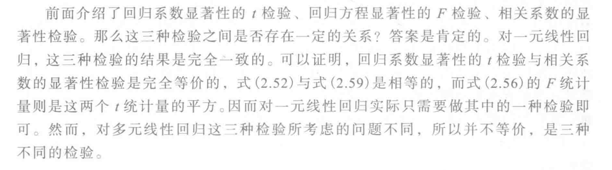

- 样本决定系数

  

  

  

### 残差分析

$$
  \begin{aligned}
  & \operatorname{Var}(e_i)\\
  & =\operatorname{Var}(y_i-\hat{y_i}) \\
  & = \operatorname{Var}(y_i)+\operatorname{Var}(\hat{y_i})-2\operatorname{Cov}(y_i,-\hat{y_i})
  \end{aligned}
$$
  记$\operatorname{Var}(y_i)$为①式，$\operatorname{Var}(\hat{y_i})$为②式，$\operatorname{Cov}(y_i,\hat{y_i})$为③式

  则①式$=\sigma^2$，②式：

$$
  \begin{aligned}
  & \operatorname{Var}\left(\hat{y}_i\right)\\
  & =\operatorname{Var}\left(\hat{\beta_0} +\hat{\beta _1} x_i\right)\\
  & =\operatorname{Var}\left(\hat{\beta_0}\right)+\operatorname{Var}\left(\hat{\beta}_1 x_i\right)+2 \operatorname{Cov}\left(\hat{\beta}_0, \hat{\beta}_1 x_i\right) \\
  & =\left(\frac{1}{n}+\frac{\bar{x}^2}{L _{x x}}\right) \sigma^2+x_i{ }^2\left(\frac{\sigma^2}{L_{x x}}\right)+2 x_i \operatorname{Cov}\left(\hat{\beta}_0, \hat{\beta}_1\right) \\
  & =\left(\frac{1}{n}+\frac{\bar{x}^2}{L_{ x x}}\right) \sigma^2+\frac{x_i^2}{L_{ x x}} \sigma^2+2 x_i\left(-\frac{\bar{x}}{L _{x x}} \sigma^2\right) \\
  & =\left(\frac{1}{n}+\frac{\bar{x}^2}{{L _{x x}}}+\frac{x_i^2}{{L_{ x x}}}-2 x_i \frac{\bar{x}}{L_{ x x}}\right) \sigma^2 \\
  & =\left(\frac{1}{n}+\frac{\bar{x}^2+x_i^2-2 x_i \bar{x}}{L_{ x x}}\right) \sigma^2 \\
  & =\left[\frac{1}{n}+\frac{\left(\bar{x}-x_i\right)^2}{L _{x x}}\right] \sigma^2 \\
  \end{aligned}
$$
  ③式：
$$
  \begin{aligned}
  & \operatorname{Cov}(y_i,\hat{y_i})\\
  & =\operatorname{Cov}(y_i,\hat{\beta_0}+\hat{\beta_1}x_i)\\
  & = \operatorname{Cov}(y_i,\hat{\beta_0})+\operatorname{Cov}(y_i,\hat{\beta_1}x_i)\\
  & = \operatorname{Cov}(y_i,\bar{y}-\hat{\beta_1}\bar{x})+\operatorname{Cov}(y_i,\frac{L_{xy}}{L_{xx}}x_i)\\
  & = \operatorname{Cov}(y_i,\frac{1}{n}\sum_{k=1}^n y_k-\frac{L_{xy}}{L_{xx}}\bar{x})+\operatorname{Cov}(y_i,x_i\sum_{k=1}^n\frac{x_k-\bar{x}}{L_{xx}}y_k)\\
  & = \operatorname{Cov}(y_i,\sum_{k=1}^n\frac{1}{n}y_k-\bar{x}\sum_{k=1}^n\frac{x_k-\bar{x}}{L_{xx}}y_k)+\operatorname{Cov}(y_i,x_i\sum_{k=1}^n\frac{x_k-\bar{x}}{L_{xx}}y_k)\\
  & = \operatorname{Cov}(y_i,\sum_{k=1}^n[\frac{1}{n}-\bar{x}\frac{x_k-\bar{x}}{L_{xx}}]y_k)+\operatorname{Cov}(y_i,\sum_{k=1}^n\frac{(x_k-\bar{x})\cdot x_i}{L_{xx}}y_k)\\
  & = (\frac{1}{n}-\bar{x}\frac{x_i-\bar{x}}{L_{xx}})\sigma^2+[\frac{(x_i-\bar{x})x_i}{L_{xx}}]\sigma^2\\
  & = \sigma^2[\frac{1}{n}-\frac{\bar{x}(x_i-\bar{x})}{L_{xx}}+\frac{(x_i-\bar{x}){x_i}}{L_{xx}}]\\
  & = \sigma^2[\frac{1}{n}+\frac{(x_i-\bar{x}){x_i}}{L_{xx}}-\frac{(x_i-\bar{x})\bar{x}}{L_{xx}}]\\
  & = \sigma^2[\frac{1}{n}+\frac{(x_i-\bar{x})^2}{L_{xx}}]
  \end{aligned}
$$

  **补充**

  - 误差项的协方差$$\operatorname{cov}\left(\varepsilon_i, \varepsilon_j\right)=\left\{\begin{array}{l}
    \sigma^2, i=j \\
    0, \quad i \neq j
    \end{array} \quad i, j=1,2, \cdots, n\right.$$
  - 即$\varepsilon_1,\varepsilon_2,...,\varepsilon_n$是独立的随机变量
  - 又因为$y_i=\beta_0+\beta_1x_i+\varepsilon_i$，则$y_1,y_2,...y_n$也是独立的随机变量
  - 进一步有随机变量$$\operatorname{cov}\left(y_i, y_j\right)=\left\{\begin{array}{l}
  \sigma^2, i=j \\
    0, \quad i \neq j
  \end{array} \quad i, j=1,2, \cdots, n\right.$$

则
$$
  \begin{aligned}
  & \operatorname{Var}(e_i)\\
  & = ①+②-2③\\
  & = \sigma^2+[\frac{1}{n}+\frac{(\bar{x}-x_i)^2}{L_{xx}}]\sigma^2-2\sigma^2[\frac{1}{n}+\frac{(x_i-\bar{x})^2}{L_{xx}}]\\
  & = \sigma^2[1+\frac{1}{n}+\frac{(\bar{x}-x_i)^2}{L_{xx}}-\frac{2}{n}-\frac{2(x_i-\bar{x})^2}{L_{xx}}]\\
  & = \sigma^2[1-\frac{1}{n}-\frac{(x_i-\bar{x})^2}{L_{xx}}]
  \end{aligned}
$$
  

- 改进的残差

  

> **标准化残差**：$\frac{e_i}{\hat{\sigma}}$，其中$\hat{\sigma}$是回归标准差，$\hat{\sigma}^2$是$\sigma^2$的无偏估计
>
> **学生化残差**：$\frac{e_i}{\sqrt{var(e_i)}}$，$\sqrt{var(e_i)}$是残差的标准差

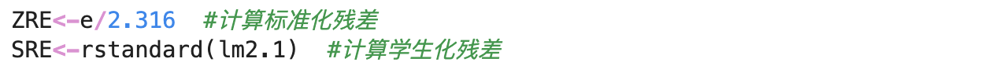

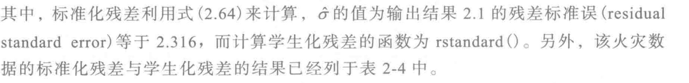

### 用R软件进行计算

用火灾损失的例子来介绍R的使用方法

- R语言读取数据

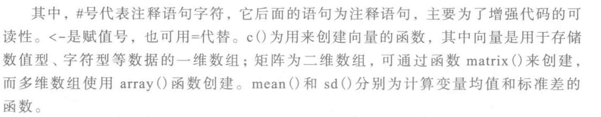

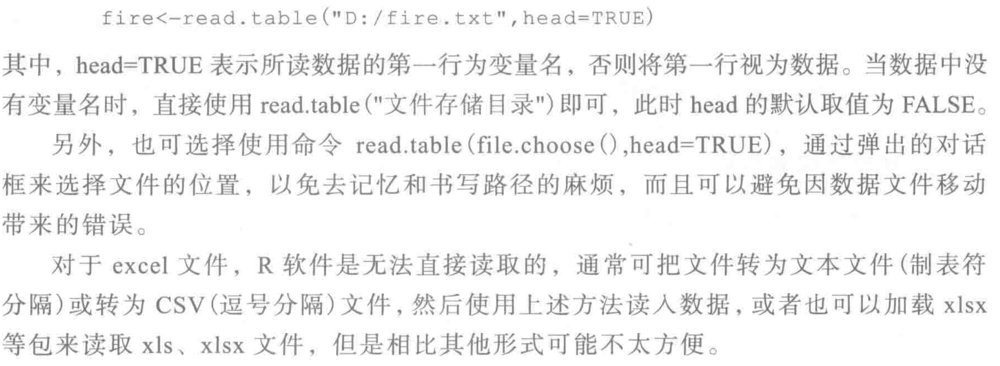

- 使用R做回归分析

  
  
  
  
  
  
  
  
  >显著代码： ` Signif. codes`是用于表示统计显著性水平的符号，在回归模型的结果摘要中显示每个变量的显著性水平。
  >
  >`'***'`：表示非常显著，$P$值小于0.001
  >
  >`'**'`：表示显著，$P$值小于0.01
  >
  >`'*'`：表示显著，$P$值小于0.05
  >
  >`'.'`：表示趋近显著，$P$值小于0.1
  >
  >`' '`：表示不显著，$P$值大于等于0.1
  >
  >`'1'`：表示没有$P$值或无法计算$P$值
  
  

> 假设我们观测了变量$(x,y)$的所有取值，此时计算出的相关系数成为**总体相关系数**，记作$\rho$，它反映了两变量之间的**真实相关程度**。

- R语言做残差分析

- R语言做区间预测

### 回归系数的区间估计

**补充**

1. 在一元线性回归模型中，回归系数$\hat{\beta_1}$​的自由度实际上是指在估计$\hat{\beta_1}$​时数据具有选择的自由度数量。由于$\hat{\beta_1}$​​​的估计依据是最小化残差平方和，在前面已经证过残差的自由度是n-2，因此上式服从自由度为n-2的t分布。

2. $P(|t|<t_{\frac{\alpha}{2}})=1-\alpha$由来：
   $$
   P(|t|>|t值|)=P值
   \\当P值<\alpha时，拒绝原假设H_0
   \\临界值P(|t|>|t值|)=\alpha
   \\1-P(·)=1-\alpha
   \\即P(|t|<|t值|)=1-\alpha
   $$

3. $1-\alpha$指的是置信水平，其中，$\alpha$是显著性水平。置信区间是在预先确定好的显著性水平下计算出来的，绝大多数情况会将$α$设为0.05，则置信度为$1-α$就是95%。

### 预测和控制

### 关于t分布表的补充

式子（2.79）展开得
$$
|\frac{y_0-\hat{y_0}}{\sqrt{1+h_{00}\hat{\sigma}}}\leq t_{\frac{\alpha}{2}}(n-2)|
\\=-t_{\frac{\alpha}{2}}(n-2)\leq\frac{y_0-\hat{y_0}}{\sqrt{1+h_{00}\hat{\sigma}}}\leq t_{\frac{\alpha}{2}}(n-2)
\\=-t_{\frac{\alpha}{2}}(n-2)\cdot{\sqrt{1+h_{00}\hat{\sigma}}}\leq y_0-\hat{y_0}\leq t_{\frac{\alpha}{2}}(n-2)\cdot{\sqrt{1+h_{00}\hat{\sigma}}} 
\\=-t_{\frac{\alpha}{2}}(n-2)\cdot{\sqrt{1+h_{00}\hat{\sigma}}}+\hat{y_0}\leq y_0\leq t_{\frac{\alpha}{2}}(n-2)\cdot{\sqrt{1+h_{00}\hat{\sigma}}}+\hat{y_0}
$$
即$y_0$的置信水平为$1-\alpha$的置信区间为
$$
\hat{y_0}\pm t_{\frac{\alpha}{2}}(n-2)\sqrt{1+h_{00}}\hat{\sigma}
$$
其中$t_{\frac{\alpha}{2}}(n-2)$是一个整体，表示$t$统计量服从自由度为$n-2$的$t$分布。又由于给定显著性水平$\alpha$，双侧检验的临界值为$t_{\frac{\alpha}{2}}$​。

当$n$趋近于无穷时，$h_{00}$趋近于0，置信区间趋近于$\hat{y_0}\pm t_{\frac{\alpha}{2}}(n-2)\cdot\sqrt{1+0}\hat{\sigma}=\hat{y_0}\pm t_{\frac{\alpha}{2}}(n-2)\hat{\sigma}$。

给出$t$分布表

当显著性水平$\alpha=0.05$时，$\frac{\alpha}{2}=0.025$，查表可知$t_{\frac{\alpha}{2}}(n-2)$收敛于1.96，可近似为2，因此$y_0$的置信水平为$1-\alpha$的置信区间为$y_0\pm2\hat{\sigma}$。

### 一元线性回归从建模到应用的全过程

## 三、多元线性回归模型

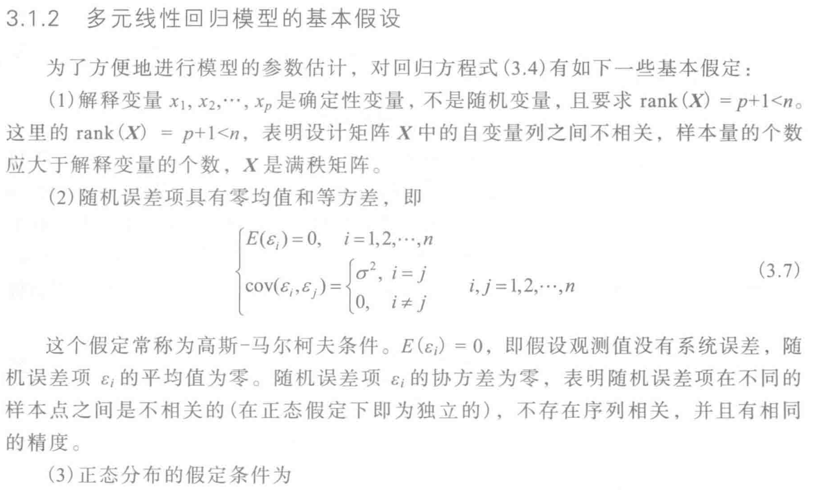

### 回归系数的估计

**计算过程**
$$
\begin{aligned}
X^{\prime} &= \left(\begin{array}{cccc}
1 & 1 & \cdots & 1 \\
x_{11} & x_{21} & \cdots & \vdots \\
\vdots &  & \ddots & \vdots \\
x_{1 p} & \cdots & \cdots & x_{np}
\end{array}\right) \\
y-X\boldsymbol{\beta} &= \left(\begin{array}{c}
y_1-\hat{\beta_0}-\hat{\beta_1} x_{11}-\cdots -\hat{\beta_p} x_{1 p} \\
y_2-\hat{\beta_0}-\hat{\beta_1} x_{21}-\cdots -\hat{\beta_p} x_{2 p} \\
\vdots \\
y_n-\hat{\beta_0}-\hat{\beta_1} x_{n1}-\cdots-\hat{\beta}_p x_{n p}
\end{array}\right)
\end{aligned}
$$

> $X^{\prime}$是指$X$的转置即$X^T$

### 回归值与残差

> 所谓“迹”，就是矩阵主对角线元素之和

- $H=H^{\prime},H^2=H$

  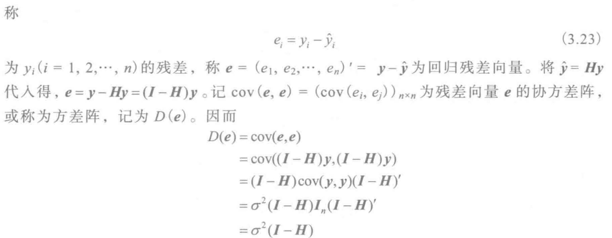

  > 其中，$cov((I-H)\bold{y},(I-H)\bold{y})\Rightarrow(I-H)cov(\bold{y},\bold{y})(I-H)^{\prime}$​为左提右转置
  > $$
  > \because H是对称矩阵
  > \\\therefore I-H也是对称矩阵
  > \\\therefore I-H=(I-H)'
  > \\又\because H是幂等阵
  > \\\therefore (I-H)(I-H)'=(I-H)
  > $$
  
  
  
  > $h_{ii}:=H的主对角线元素$

> $p$是自变量的个数。

### 有关估计量的性质

与式子(3.18)相同

$D(\bold{\hat{\beta}})$证明的第三步中，依旧是左提右置

$$
X=\left(\begin{array}{cc}
1 & x_{1} \\
1 & x_2 \\
\cdots \\
1 & x_n
\end{array}\right) \quad X^{\prime}=\left(\begin{array}{cccc}
1 & 1 & & 1 \\
x_1 & x_2 & \cdots & x_n
\end{array}\right)
$$

$$
\begin{aligned}
|XX^\prime|
=& n \sum_{i=1}^n x_i^2-\left(\sum_{i=1}^n x_i\right)^2 \\
= & n \sum_{i=1}^n x_i^2-n^2 \bar{x}^2 \\
= & n\left(\sum_{i=1}^n x_i^2-n x^2\right) \\
= & n\left(\sum_{i=1}^n x_i^2-n \bar{x}^2+n \bar{x}^2-n \bar{x}^2\right) \\
= & n\left(\sum_{i=1}^n x_i^2-2 n \bar{x}^2+n \bar{x}^2\right) \\
= & n\left(\sum_{i=1}^n x_i^2-2 n \bar{x} \sum_{i=1}^n x_i+\sum_{i=1}^n\bar{x}^2\right) \\
= & n \sum_{i=1}^n\left(x_i{ }^2-2 \bar{x} x_i+\bar{x}^2\right) \\
= & n \sum_{i=1}^n\left(x_i-\bar{x}\right)^2 \\
= & n L_ {x x}
\end{aligned}
$$

则有

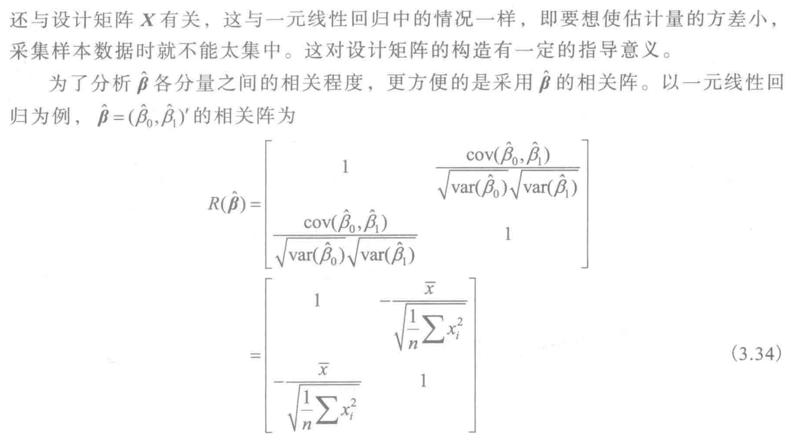

### 回归方程的显著性检验

- $t$检验（**检验方程组的显著性**）

> 分子中$p$表示自由度为$p$，因为在$SSR$中，$x_1$到$x_p$为预测$\hat{y_i}$所做的贡献，它们包含了所有关于$x_1$到$x_p$的信息，所以需要将$SSR$平均分配给这$p$个自变量。
>
> 分母中$n-p-1$表示自由度为$n-p-1$。
>
> 详细解读请看上一章的“<u>关于自由度的补充</u>”。

- $t$检验（**检验单个变量$x_j$的显著性**）

> 记$(X'X)^{-1}$中的每一个元素为$c_{ij}$，则它的主对角线元素可记为$c_{jj}$​
> $$
> \because方差阵~ D(\boldsymbol{\hat{\beta}})=\sigma^2(\bold{X'X})^{-1}
> \\其中对角线元素为单个回归系数(\beta_j)的方差，其余元素为两个回归系数(\beta_i,\beta_j)的协方差
> \\\therefore var(\hat{\beta_j})=c_{jj}\sigma^2
> $$

$$
t_j=\frac{\hat{\beta_j}-\beta_j}{\sqrt{var(\hat{\beta_j})}} & (1)
\\\beta_j=0&(2)
$$

- SPSS输出结果 

1. 以$x_1$为例，由于p值=0.000..<0.05，得出结果$\beta_1$​显著。观察后可知$x_4,x_6,x_7,x_8,x_9$的系数均不显著（常数项不需要处理，因为检验的时候只检验了$\beta_1-\beta_p$），需要剔除
2. 首先剔除不满足显著性当中，p值最大的系数，这里是$\beta_4$，剔除完后需要重新构建回归方程
3.  查看新回归方程各系数的p值，执行（2）的操作
4. 依次剔除完后，剩余的变量都是显著的，构建最终的回归方程

$$
\hat{y}=-1694.627+1.364x_1+1.768x_2+2.289x_3+1.742x_5
$$

> $SSE_{(j)}$​​表示剔除后的残差平方和
>
> 分子中的1代表是单个变量，因此称为偏$F$统计

- 回归系数的置信区间

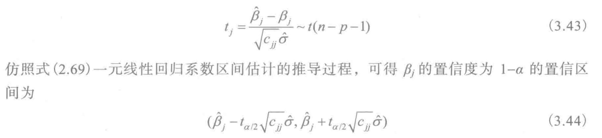

- 拟合优度

> 决定系数$R^2=\frac{SSR}{SST}=1-\frac{SSE}{SST}$
>
> 称$R=\sqrt{R^2}=\sqrt{\frac{SSR}{SST}}$为复相关系数

### 中心化和标准化

- 中心化

- 标准化回归系数

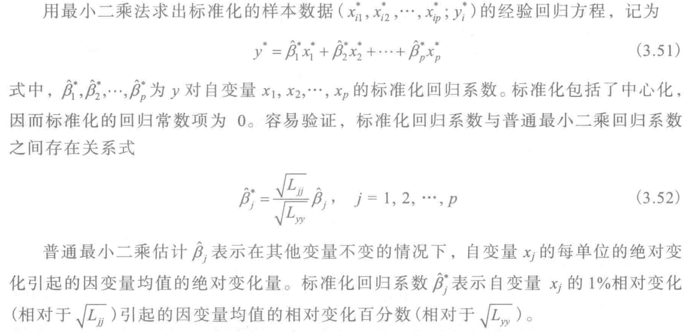

> 其中$L_{jj}=\sum_{i=0}^n(x_{ij}-\bar{x}_{j})^2$

### 相关阵与偏相关系数

- 样本相关阵

> 1. 复相关系数$R=\sqrt{\frac{SSR}{SST}}$，其中$SSR$包含了$x_1$到$x_p$这$p$个变量对$y$的回归效果，反映的是$y$与一组自变量的相关性；简单相关系数$r=\frac{L_{xy}}{\sqrt{L_{xx}L_{yy}}}$​，只表示了$x_i$与$y_i$的相关性。因此在多元中，$R$与$r$不再等价。
> 2. 对于增广相关阵，我们希望自变量之间，两两之间的相关系数越小越好； 每个自变量与$y$之间相关程度越大越好。

- 偏决定系数

1. 两个自变量的偏决定系数

   

   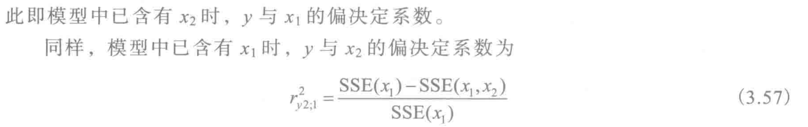

2. 一般情况

   

> $SSE$的减小预示着$SSR$的增大。

- 偏相关系数

### 关于决定系数与相关系数的补充

- **简单相关系数**： $r_{ij}=\frac{L_{ij}}{\sqrt{L_{ii}\cdot L_{jj}}}$
- **决定系数**： $R^2=\frac{SSR}{SST}$
- **样本复相关系数**： $R=\sqrt{\frac{SSR}{SST}}$
- **偏决定系数**： $r^2_{y1;2,3,...,p}=\frac{SSE(x_2,...,x_p)-SSE(x_1,x_2,...,x_p)}{SSE(x_2,...,x_p)}$
- 偏决定系数考量的因素是：在每一次添加自变量后，$SSE$下降的程度
- **偏相关系数**：偏决定系数的平方根
- **相关阵**： 计算每一对自变量之间的简单相关系数所得到的一个矩阵

### R语言实例分析

**例3-1**

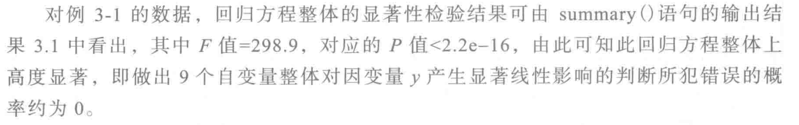

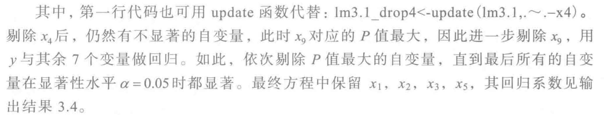

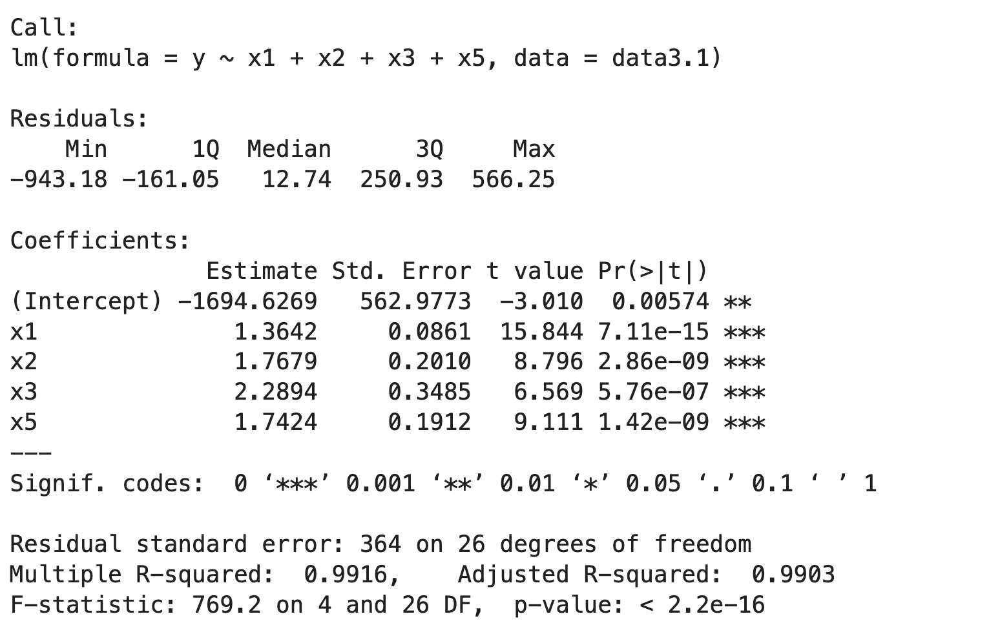

**例3-2**

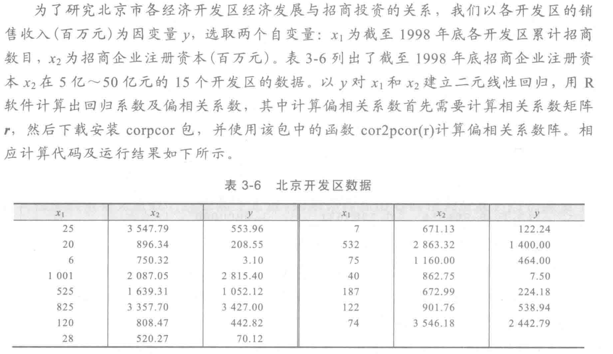

1. **偏决定系数**

   $r^2_{y1,2}=0.802^2=0.643$

   $r^2_{y2,1}=0.739^2=0.546$

2. **决定系数**

   $r_{y1}^2=0.807^2=0.651$​

   $r_{y2}^2=0.746^2=0.557$

3. $r_{y1}^2=\frac{SSR(x_1)}{SST}=1-\frac{SSE(x_1)}{SST}=0.651=65.1\%$

4. $r^2_{y2;1}=\frac{SSE(x_1)-SSE(x_1,x_2)}{SSE(x_1)}=0.546=54.6\%$

5. **自变量$x_1$和$x_2$消除$y$变差的总比例为**
   $$
   \begin{align*}
   &\frac{SST-SSE(x_1,x_2)}{SST} 
   \\& = 1-\frac{SSE(x_1)}{SST}\cdot\frac{SSE(x_1,x_2)}{SSE(x_1)} \\
   & = 1-(1-r_{y1}^2)(1-r^2_{y2;1}) \\
   & = 84.2\% \\
   & = R^2
   \end{align*}
   $$

### 多元线性回归的建模过程

**例3-3**

## 四、违背基本假设的几种情况

### 异方差产生的原因及影响

- **原因**

### 关于截面数据和面板数据的补充

- **截面数据**是指在同一时间(时期或时点)截面上反映一个总体的一批(或全部)个体的同一特征变量的观测值，是样本数据中的常见类型之一。例如，工业普查数据，人口普查数据，家庭收入调查数据。
- **时间序列数据**是指在不同时间点上收集到的数据，这类数据反映了某一事物、现象等随时间的变化状态或程度，如<u>我国国内生产总值从1949到2009的变化</u>就是时间序列数据。
- **面板数据**是指<u>在时间序列上取多个截面</u>，在这些截面上同时选取样本观测值所构成的样本数据。可理解为一个$m\times n$的数据矩阵，记载的是$n$个时间节点上，$m$​个对象的某一数据指标。

截面数据更容易产生异方差性的原因有以下几点：

1. 不同个体之间的差异：截面数据通常涉及不同个体或单位，而这些个体之间可能存在差异，例如不同家庭的收入水平、不同地区的经济发展程度等，这些差异会导致因变量的方差在个体之间发生变化。

2. 不同观测时期的差异：截面数据收集的是在同一时间点或时期内的数据，而这些时期可能存在不同的经济、政治或社会环境等因素。这些时期差异也可能引起因变量的方差发生变化。

3. 异质性效应：截面数据中可能存在异质性效应，即不同个体对自变量的响应程度不同，这种异质性效应使得因变量的方差在不同个体之间产生差异。

因此，截面数据更容易受到个体差异、观测时期差异和异质性效应等因素的影响，从而产生异方差性。

- **影响**

由于最小二乘法的前提假设条件不成立(不满足**等方差**、**不相关**)，导致由普通最小二乘法计算得出的方差估计值实际上会小于真实值(因为在GM条件成立下，由最小二乘法计算出的方差为最小方差$D$，其他情况得到的方差$D’$都会大于$D$)，就是低估$\hat{\beta}$的真实方差，进一步导致高估回归系统的$t$检验($t=\frac{\hat{\beta_1}-E(\hat{\beta}_1)}{\sqrt{D(\hat{\beta_1})}}$,显然$D$越小，$t$越大)。

### 一元加权最小二乘估计

**异方差性的诊断**

- 残差图分析法

- 等级相关系数法

> 1. 注意在一元线性回归中，我们曾经构造过$t$统计量$t=\frac{\sqrt{n-2}r}{\sqrt{1-r^2}}$，但当时的$r$是简单相关系数，注意和等级相关系数$r_s$甄别。
> 2. 这里的判断条件是$|t|<|t值|$为不存在异方差性，因为原假设$H_0$就是认为$|e_i|$与$x_i$不相关，只有大于|$t$值|时才认为异方差性问题存在。

在$R$软件中，残差图如下所示：

把$x_i$和$|e_i|$按递增的次序排列，其中$x_1$值最小，所以$x_1$等级为1；$x_8$的残差绝对值最小，$|e_8|$等级为1。

$d_i$由$x_i-|e_i|$计算得出。最后再由公式计算出等级相关系数$r_s$​，在给定的显著性水平(如$\alpha=0.05$)下，判断是否可以认为异方差性存在。

> 简单相关系数只适用于衡量直线趋势的变量间的相关性，而等级相关系数可以更准确地反映非线性相关的情况。

- **一元加权最小二乘估计**

> 权函数就是关于$x_i$所对应的权重的函数，在这里权函数就是$w_i=\frac{1}{x_i^m}$。

- **寻找最优权函数**

> 具体代码会在后面专门开一节展示。

由于寻找最优权函数的过程是通过最大化似然函数实现的，因此我们需要先了解一下**极大似然法**。

### 关于极大似然法的补充

极大似然估计提供了一种给定观察数据来评估模型参数的方法，即模型已定，但参数未知。在这里，这个参数就是幂指数$m$，通过最大化似然函数，找出概率最大时$m$的值，就是$m$的最优取值，所以我们要找出似然函数最大时对应的$m$值：

 

### 多元加权最小二乘估计

- 多元加权最小二乘法

$$
\begin{aligned}
&X'W(\bold{y}-X\boldsymbol{\hat\beta})=0
\\\Rightarrow& X'WX\boldsymbol{\hat\beta}=X'W\bold{y}
\\\Rightarrow&\boldsymbol{\hat\beta}=(X'WX)^{-1}X'W\bold{y}
\end{aligned}
$$
其中，对不同的回归系数求偏导有：
$$
\left\{\begin{array}{l}
\left.\frac{\partial Q}{\partial \beta_0}\right|_{\beta_0=\hat{\beta}_0}=-2 \omega_0\sum_{i=1}^n\left(y_i-\hat{\beta}_0-\hat{\beta}_1 x_{i 1}-\hat{\beta}_2 x_{i 2}-\cdots-\hat{\beta}_p x_{i p}\right)=0 \\
\left.\frac{\partial Q}{\partial \beta_1}\right|_{\beta_1=\hat{\beta}_1}=-2 \omega_1\sum_{i=1}^n\left(y_i-\hat{\beta}_0-\hat{\beta}_1 x_{i 1}-\hat{\beta}_2 x_{i 2}-\cdots-\hat{\beta}_p x_{i p}\right) x_{i 1}=0 \\
\left.\frac{\partial Q}{\partial \beta_2}\right|_{\beta_2=\hat{\beta}_2}=-2 \omega_2\sum_{i=1}^n\left(y_i-\hat{\beta}_0-\hat{\beta}_1 x_{i 1}-\hat{\beta}_2 x_{i 2}-\cdots-\hat{\beta}_p x_{i p}\right) x_{i 2}=0 \\
\quad \cdots \cdots \\
\left.\frac{\partial Q}{\partial \beta_p}\right|_{\beta_p=\hat{\beta}_p}=-2 \omega_p\sum_{i=1}^n\left(y_i-\hat{\beta}_0-\hat{\beta}_1 x_{i 1}-\hat{\beta}_2 x_{i 2}-\cdots-\hat{\beta}_p x_{i p}\right) x_{i p}=0
\end{array}\right.
$$

- 权函数的确定方法

> 等级相关系数越大，异方差性越强。

获取残差$e$的绝对值$|e|$，并求$|e|$与$x$的等级相关系数：

发现$m$取第4个值(即$m=2.5$)时似然函数最大，所以幂指数最优取值为$2.5$。

